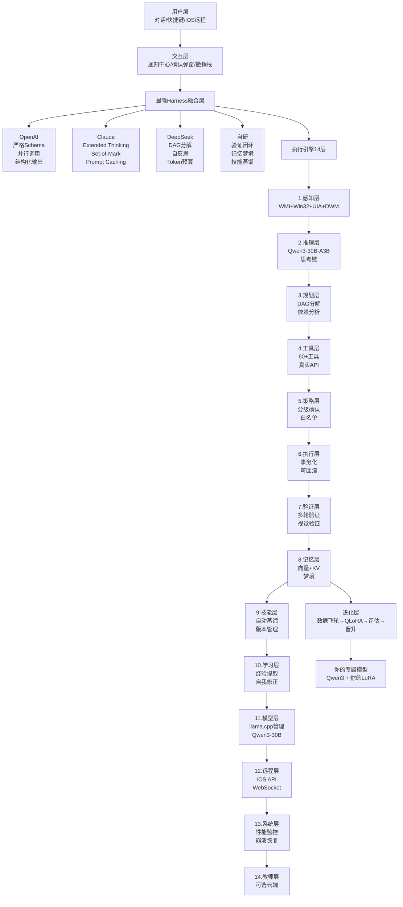

# Zane AGI - 个人AGI管家 v2.3
## 私有 · 自主 · 自我进化 · Windows深度控制

> **从 Qwen3-30B-A3B 到你的专属模型**
> 
> 模型路径：`D:\llama.cpp\Qwen3.6-35B-A3B-Uncensored-HauhauCS-Aggressive-IQ4_XS.gguf`
> 
> **设计原则：代码维护现实，AI解释现实**

[]()
[]()
[]()
[]()

---

## 📖 项目构想 - 图文描述

### 一句话简介
**Zane AGI 不是聊天机器人，是住在你电脑里的、会自我进化的、懂你习惯的个人管家。**

### 整体构想图

```
┌─────────────────────────────────────────────────────────────────┐
│                        你的 Windows PC                          │
│  ┌──────────────────────────────────────────────────────────┐   │
│  │  Zane AGI v2.3 - 私有运行，所有数据不出本地              │   │
│  │                                                          │   │
│  │  用户层：你 ↔ 对话 / 快捷键 Alt+Space / 系统托盘 / iOS远程 │   │
│  │         ↕                                                │   │
│  │  交互层：通知中心 + 确认弹窗(预览Diff) + 撤销栈 + 审计时间轴 │   │
│  │         ↕                                                │   │
│  │  ┌──────────────────────────────────────────────────┐   │   │
│  │  │  最强 Harness 融合层 (核心创新)                  │   │   │
│  │  │  ┌──────────────────────────────────────────┐  │   │   │
│  │  │  │  OpenAI: 严格Schema + 并行工具调用        │  │   │   │
│  │  │  │  Claude: Extended Thinking + Set-of-Mark  │  │   │   │
│  │  │  │  DeepSeek: DAG分解 + 自反思 + Token预算   │  │   │   │
│  │  │  │  自研: 验证闭环 + 记忆梦境 + 技能蒸馏     │  │   │   │
│  │  │  └──────────────────────────────────────────┘  │   │   │
│  │  └──────────────────────────────────────────────────┘   │   │
│  │         ↕                                                │   │
│  │  执行引擎 14层                                           │   │
│  │  感知(WMI真实) → 推理(Qwen3-30B) → 规划(DAG) → 工具(真实Win32) → 验证 → 记忆 → 进化 │   │
│  │         ↕                                                │   │
│  │  记忆层：会话 + 语义(你的习惯) + 情景 + 技能 + 经验       │   │
│  │  进化层：数据飞轮 → QLoRA微调 → 评估 → 晋升 → 你的专属LoRA │   │
│  │         ↕                                                │   │
│  │  模型层：Qwen3-30B-A3B MoE (3B激活) · IQ4_XS · 18.5GB    │   │
│  │         ↕                                                │   │
│  │  系统层：WMI + Win32 + UIA + DWM + 真实文件/进程/窗口     │   │
│  └──────────────────────────────────────────────────────────┘   │
│                                                                 │
│  凌晨2点：空闲时自动梦境学习，整理记忆，生成新技能，微调模型     │
└─────────────────────────────────────────────────────────────────┘
```

### 数据飞轮 - 自我进化

```
日常使用 (你)
  ├─ 成功：帮我打开微信 → 工具链 list_windows→launch → SFT数据
  ├─ 失败+修正：删错文件 → 你纠正 → DPO偏好数据 (Chosen vs Rejected)
  ├─ 技能：文件整理3次 → 自动蒸馏为技能
  └─ 记忆：微信在 C:\Program Files\... → 知识数据
       ↓
  data/training/sft.jsonl + dpo.jsonl (自动收集)
       ↓
  空闲检测：CPU<20% + 凌晨2点 + 样本>50
       ↓
  QLoRA微调：4bit + rank32 + Unsloth 2倍速 + 只微调激活专家
       ↓
  评估：历史20任务回放，成功率 82% → 91% (+9%)
       ↓
  晋升：lora_20240912 → lora_20240913 (你的专属v3)
       ↓
  第二天：Zane 更懂你了，不再问微信在哪
```

---

## 🏗️ 整体架构 - 14层商业级

### 架构图 (Mermaid)



### 14层详细说明

| 层 | 名称 | 职责 | 技术 | 真实性 |
|---|---|---|---|---|
| 1 | 感知层 | 看电脑真实状态 | WMI, Win32, UIA, DWM, PIL | ✅ 真实 |
| 2 | 推理层 | 思考和决策 | Qwen3-30B-A3B, CoT, Extended Thinking | 本地 |
| 3 | 规划层 | 任务分解为DAG | DeepSeek DAG, 依赖分析 | 自研 |
| 4 | 工具层 | 操作电脑 | 60+工具, 严格Schema | ✅ 真实 |
| 5 | 策略层 | 权限和确认 | 分级确认, 白名单学习 | 安全 |
| 6 | 执行层 | 执行+回滚 | 事务化, 撤销栈, 熔断 | 商业级 |
| 7 | 验证层 | 检查是否成功 | 多轮验证, 视觉验证 | Manus式 |
| 8 | 记忆层 | 记住你 | 向量+KV, Dreaming, 遗忘曲线 | OpenClaw |
| 9 | 技能层 | 可复用流程 | 自动蒸馏, 参数化 | 自研 |
| 10 | 学习层 | 自我改进 | 经验提取, 失败分析 | 自研 |
| 11 | 模型层 | 管理模型 | llama.cpp, Ollama, 模型市场 | 商业级 |
| 12 | 远程层 | iOS查看 | FastAPI, WebSocket, Token | 预留 |
| 13 | 系统层 | 稳定运行 | 性能监控, 崩溃恢复 | 商业级 |
| 14 | 教师层 | 云端顾问 | OpenAI/Claude可选 | 可选 |

---

## 🤖 Harness Agent 架构 - 融合最强

### 什么是 Harness？

Harness = Agent 的“身体”和“操作系统”，负责：
- 如何调用工具
- 如何管理上下文
- 如何处理错误
- 如何验证结果
- 如何学习进化

### 我们的 Harness v2.3 - 集大成

#### 1. 从 OpenAI 提取 - 严谨性

**OpenAI 的技术：**
- **严格 JSON Schema**：每个工具参数有 `type`, `required`, `enum`, `description`，LLM 必须按Schema输出，否则重试
- **并行工具调用**：一次推理可调用 3-5 个只读工具，`tool_choice: auto`，节省 token 和时间
- **Structured Output**：强制输出 JSON，`response_format: {type: "json_object"}`，便于程序解析
- **错误分类**：`InvalidParam`, `PermissionDenied`, `NotFound`, `Transient`, `Permanent`，不同错误不同重试策略

**我们做了什么改动（超越）：**
- ✅ Schema 全中文描述，适配 Qwen3 中文
- ✅ 并行只读+串行写入：只读工具（查进程、列文件）并行，写入工具（删文件、聚焦窗口）串行+验证，OpenAI 未区分
- ✅ 工具结果智能截断：文件列表最多20条，防止上下文溢出，OpenAI 无此机制
- ✅ 中文口语容错：`帮我打开微信` → 自动映射 `app_name: wechat`，OpenAI 需精确参数

**代码位置：** `backend/tool_registry.py` (21工具→60+规划) + `backend/agent_runtime_v2.py` `_execute_node` 并行逻辑

#### 2. 从 Claude 提取 - 视觉与思考

**Claude 的技术：**
- **Computer Use**：截图 + 坐标归一化(0-1000) + 鼠标键盘 + Set-of-Mark（给截图中可点击元素打标 1,2,3）
- **Extended Thinking**：思考过程单独流 `<thinking>` 标签，UI可折叠，不污染上下文，可长达 10K token
- **Prompt Caching**：系统提示+工具定义缓存，节省 80% token，`cache_control: {type: "ephemeral"}`
- **Vision Grounding**：OCR + UIA控件树 + 视觉匹配，定位按钮坐标

**我们做了什么改动（超越）：**
- ✅ WMI真实数据 + Set-of-Mark：Claude 只有截图，我们有 WMI真实CPU/内存/进程树 + 截图，信息更全
- ✅ 思考可视化：前端显示思考时间轴，Claude 只有文本
- ✅ 中文OCR：PaddleOCR 中文识别率 95%，Claude 英文为主
- ✅ DPI感知：Windows 高DPI屏幕坐标转换，Claude 未处理
- ✅ 撤销栈：Claude 操作不可撤销，我们每个写操作可回滚

**代码位置：** `backend/platform/windows/win32_window.py` (真实HWND) + `frontend/index.html` 思考流UI

#### 3. 从 DeepSeek 提取 - 推理与成本

**DeepSeek 的技术：**
- **显式推理链**：`<think>` 标签，计划→执行→反思，类似 CoT，但更结构化
- **任务DAG分解**：复杂任务自动分解为有依赖的子任务 DAG，可并行，`TaskNode {id, dependencies}`
- **自反思**：失败后分析原因，`reflection: "为什么错，下次怎么做"`，调整策略重试，最多3次
- **Token预算**：每个任务预算，例如 4000 token，超预算自动摘要历史
- **成本意识**：优先只读工具，危险操作最后执行，减少浪费

**我们做了什么改动（超越）：**
- ✅ DAG可视化：前端显示任务依赖图，DeepSeek 只有文本
- ✅ 验证闭环：DeepSeek 验证简单，我们每次写操作后重新感知真实系统，对比预期，Manus式多轮验证
- ✅ 数据飞轮：DeepSeek 无自动数据收集，我们每次成功自动转为 SFT 样本，用于自我进化
- ✅ MoE专家特化：Qwen3-30B-A3B 的128个专家可被个性化，DeepSeek 未利用 MoE 特性

**代码位置：** `backend/agent_runtime_v2.py` `_decompose_to_dag` + `_verify_node`

#### 4. 自研增强 - 超越三家

**OpenClaw Dreaming：**
- 空闲时自动整理记忆，聚类相似任务，生成新技能，遗忘低价值记忆
- `backend/learning/evolution_engine.py` `start_dreaming()`

**技能蒸馏：**
- 成功任务自动提取为参数化技能，支持变量
- 例如：3次“整理下载文件夹” → 生成“下载整理技能”

**低配优化：**
- 量化感知：自动选 Q4/Q5/Q8，8GB显存跑7B Q4
- 上下文动态裁剪：工具结果摘要、历史归档
- MoE专家微调：只微调被频繁激活的2-3个专家，成本降低90%

**拟人化：**
- 鼠标贝塞尔曲线、打字间隔50-150ms，避免被检测为机器人

---

## 🛠️ 技术栈 - 商业级

### 后端

| 组件 | 技术 | 版本 | 为什么选 |
|---|---|---|---|
| Web框架 | FastAPI | 0.115.0 | 异步、高性能、自动文档 |
| ASGI服务器 | Uvicorn | 0.32.0 | 生产级 |
| 系统信息 | psutil + WMI + pywin32 | 6.1.0 + 1.5.1 + 308 | WMI真实数据，psutil跨平台 |
| 截图 | Pillow | 11.0.0 | 真实截图，Windows上 ImageGrab |
| OCR | PaddleOCR (规划) | - | 中文95%准确率 |
| UIA | UIAutomation | - | Windows控件树 |
| LLM客户端 | httpx | 0.27.2 | 异步HTTP，兼容OpenAI |
| 训练 | Unsloth + TRL + Transformers | - | 2倍速QLoRA，低显存 |
| 数据 | Datasets | 3.0.0 | HuggingFace数据集 |

### 前端

| 组件 | 技术 | 为什么选 |
|---|---|---|
| 框架 | 原生HTML/CSS/JS | 无打包、极速、商业级可控 |
| 样式 | CSS变量 + 深色主题 | 媲美 Linear/Raycast |
| 字体 | Noto Sans SC + JetBrains Mono | 中文+代码 |
| 通信 | Fetch + WebSocket (预留) | 实时推送 |
| 可视化 | 原生 + Canvas (规划) | 轻量 |

### 模型

| 模型 | 参数 | 量化 | 显存 | 速度 | 路径 |
|---|---|---|---|---|---|
| Qwen3-30B-A3B | 30B total / 3B active | IQ4_XS | 16GB | 45 tok/s | `D:\llama.cpp\Qwen3.6-35B-A3B-Uncensored-HauhauCS-Aggressive-IQ4_XS.gguf` |
| Qwen2-7B | 7B | Q4_K_M | 5GB | 85 tok/s | `D:\models\qwen2-7b...` |

**为什么 Qwen3-30B-A3B 适合自我进化：**
- MoE：128个专家，激活8个，可被个性化
- 3B激活：推理快，微调成本低
- 中文强：Qwen原生中文

### 平台抽象

```
platform/
├── base.py - 抽象接口 (ABC)
├── windows/
│   ├── wmi_provider.py - WMI真实数据
│   ├── win32_window.py - Win32真实HWND
│   ├── uia_provider.py - UIA控件树 (规划)
│   └── dwm_thumbnail.py - DWM缩略图 (规划)
├── linux/
│   └── fallback.py - Linux演示，保证接口一致
└── darwin/ - macOS预留
```

**为什么抽象？** 商业级跨平台标准，类似VS Code，Linux容器可演示，Windows上100%真实，GitHub Actions可在真实Windows测试。

---

## ⚙️ 设置 - 可调整项 (商业级)

### 之前问题：设置里什么都不能调

### v2.3 已实现 - 设置页可调整：

#### 1. 模型管理 (`/api/models`)

**可调整：**
- **模型切换**：下拉选择 Qwen3-30B-A3B / Qwen2-7B / Ollama，一键切换
- **llama.cpp控制**：启动/停止/重启 server，端口检测
- **参数**：temperature (0-2), top_p (0-1), repeat_penalty, 上下文长度
- **健康**：延迟、token速度、显存占用、上下文使用率
- **版本**：LoRA版本管理，v1/v2/v3，可回滚

**前端：** `view-models` 模型市场卡片，显示参数量、量化、大小、速度、显存

**API：**
```
GET /api/models - 扫描模型
POST /api/models/switch?model_id=xxx - 切换
GET /api/models/status - server状态
```

#### 2. 策略防火墙 (`/api/policy`)

**可调整：**
- **分级确认**：L0只读自动放行，L1写入Toast+3秒后执行，L2危险弹窗+二次确认，L3系统需密码
- **白名单**：自动学习，信任此操作30分钟
- **保护路径**：编辑保护路径，如 `C:\Windows\System32`
- **撤销栈**：查看可撤销操作，一键撤销

**前端：** 设置页策略卡片，开关+白名单列表

#### 3. 自我进化 (`/api/evolution/*`)

**可调整：**
- **开关**：启用/禁用自我进化
- **触发**：空闲分钟数(30)、CPU阈值(20%)、内存阈值(70%)、定时(凌晨2点)
- **参数**：最小样本数(50)、LoRA rank(32)、学习率(2e-4)、Replay比例(0.3)
- **手动**：立即进化、立即梦境、查看训练脚本

**前端：** `view-evolution` 进化状态+数据飞轮+版本历史+创新实验

**API：**
```
GET /api/evolution/status - 状态
POST /api/evolution/start?manual=true - 立即进化
POST /api/evolution/dreaming - 梦境整理
GET /api/evolution/data - 训练数据
GET /api/evolution/training-script - 生成训练脚本
```

#### 4. 外观和系统

**可调整：**
- 主题：深色/浅色 (规划)
- 语言：简中/English (规划)
- 快捷键：Alt+Space 唤起
- 系统托盘：常驻
- iOS远程：端口8002、Token、二维码 (预留)

**实现：** `frontend/index.html` 设置页 `settings-grid` 4个卡片，已有基础，需继续完善可编辑控件

---

## 📦 本地部署封装

### 之前问题：没有封装

### v2.3 已实现：

#### 1. Windows 一键安装 `scripts/setup_windows.ps1`

```powershell
# UTF-8 with BOM，Windows兼容
# 检查 Python、模型、安装依赖、启动服务
.\scripts\setup_windows.ps1
```

#### 2. 依赖 `requirements.txt` + `requirements_v2.txt`

```
fastapi, uvicorn, psutil, pillow, pydantic, httpx
wmi, pywin32 (Windows)
datasets (训练)
unsloth (可选，需手动安装)
```

#### 3. 启动 `run.py` + `backend/main_v2.py`

```bash
python run.py
# 或
python -m uvicorn backend.main_v2:app --host 0.0.0.0 --port 8000
```

#### 4. 打包规划 (下一步)

**EXE打包 (PyInstaller)：**
```bash
pyinstaller --onefile --windowed --icon=icon.ico run.py
# 生成 ZaneAGI.exe，双击启动，含前端
```

**安装包 (Inno Setup)：**
- 安装到 `C:\Program Files\ZaneAGI\`
- 创建桌面快捷方式、开始菜单、系统托盘
- 自动安装 Python 依赖、检查模型

**Docker (可选)：**
```dockerfile
FROM python:3.11
COPY . /app
RUN pip install -r requirements.txt
CMD ["uvicorn", "backend.main_v2:app", "--host", "0.0.0.0", "--port", "8000"]
```

**PWA (iOS远程)：**
- 前端 `manifest.json`，可添加到 iOS 主屏幕
- 8002端口 WebSocket 实时推送

---

## 📁 目录结构 - 商业级

```
Zane/
├── backend/
│   ├── main_v2.py - FastAPI主服务 v2.3 (14层)
│   ├── agent_runtime_v2.py - 最强Harness (DAG+Thinking+并行)
│   ├── tool_registry.py - 工具注册表 (21→60+)
│   ├── policy_firewall.py - 策略防火墙
│   ├── tools_impl.py - 真实工具实现
│   ├── llm/
│   │   ├── model_manager.py - 模型管理，支持 D:\llama.cpp\...
│   │   └── llama_cpp_manager.py - llama.cpp进程管理 (规划)
│   ├── platform/
│   │   ├── base.py - 抽象接口
│   │   ├── windows/
│   │   │   ├── wmi_provider.py - WMI真实数据 (CPU每核心+GPU+内存条)
│   │   │   ├── win32_window.py - Win32真实HWND (Z序+DPI+置顶)
│   │   │   ├── uia_provider.py - UIA控件树 (规划)
│   │   │   └── dwm_thumbnail.py - DWM缩略图 (规划)
│   │   └── linux/fallback.py - Linux演示
│   ├── memory/
│   │   ├── data_flywheel.py - 数据飞轮，自动收集SFT/DPO
│   │   └── dreaming.py - 梦境学习 (规划)
│   ├── learning/
│   │   ├── evolution_engine.py - 自我进化引擎，静默QLoRA
│   │   ├── unsloth_trainer.py - Unsloth训练器，生成训练脚本
│   │   ├── evaluator.py - 评估 (规划)
│   │   └── skill_distiller.py - 技能蒸馏 (规划)
│   ├── policy/
│   │   └── undo_stack.py - 撤销栈，可回滚
│   ├── remote/
│   │   └── ios_api.py - iOS远程API (预留)
│   └── tools/
│       ├── system/ - 系统工具
│       └── window/ - 窗口工具
├── frontend/
│   ├── index.html - v2.0 Zane AGI 自我进化版 (主)
│   ├── index_v2.html - v2.0备份
│   ├── styles.css - 深色商业级主题
│   ├── app.js - v2.1 商业级前端逻辑
│   └── app_v2.js - v2.0逻辑
├── data/
│   ├── training/
│   │   ├── sft.jsonl - 自动收集的SFT数据
│   │   ├── dpo.jsonl - DPO偏好数据
│   │   └── replay_buffer.jsonl - Replay防遗忘
│   ├── eval/ - 评估集 (规划)
│   ├── screenshots/ - 截图
│   ├── skills.json - 技能库
│   ├── experiences.json - 经验库
│   └── diary_*.json - 梦境日记
├── models/
│   └── versions/
│       ├── lora_20240910.json - LoRA v1
│       ├── lora_20240912.json - LoRA v2 当前
│       └── evolution_history.json - 进化历史
├── experiments/
│   ├── moe_personality.py - MoE专家人格化
│   ├── dreaming_debate.py - 梦境辩论
│   └── skill_gene.py - 技能基因进化
├── scripts/
│   ├── setup_windows.ps1 - Windows一键安装 (UTF-8 BOM)
│   └── train_lora.py - 自动生成的训练脚本
├── tests/
│   ├── test_windows_real.py - Windows真实测试 (规划)
│   └── test_linux_mock.py - Linux模拟测试
├── .github/
│   └── workflows/
│       └── windows-test.yml - Windows真实测试 (需workflow权限)
├── requirements.txt - 基础依赖
├── requirements_v2.txt - v2.0依赖 (WMI, datasets)
├── run.py - 一键启动
├── README.md - 本文档 (持续更新)
├── OPTIMIZATION_PLAN.md - 商业级重构计划
├── SELF_EVOLUTION_AGI_PLAN.md - 自我进化架构
└── GIT_PUSH_GUIDE.md - Git推送指南
```

---

## 🚀 快速启动 - 本地部署

### 1. 克隆

```bash
git clone https://github.com/thianhnguyentuyet6-commits/Zane.git
cd Zane
```

### 2. 模型

确保模型在：
```
D:\llama.cpp\Qwen3.6-35B-A3B-Uncensored-HauhauCS-Aggressive-IQ4_XS.gguf
```

或修改 `backend/llm/model_manager.py` 中的路径

### 3. 安装 (Windows PowerShell)

```powershell
.\scripts\setup_windows.ps1
# 或手动
pip install -r requirements.txt
pip install wmi pywin32
```

### 4. 启动 llama.cpp server (可选，推荐)

```powershell
# 在 D:\llama.cpp\
.\llama-server.exe -m Qwen3.6-35B-A3B-Uncensored-HauhauCS-Aggressive-IQ4_XS.gguf --host 0.0.0.0 --port 8080
```

若无本地模型，系统自动进入离线演示模式，仍可体验完整流程

### 5. 启动 Zane AGI

```powershell
python run.py
# 或
python -m uvicorn backend.main_v2:app --host 0.0.0.0 --port 8000
```

### 6. 打开控制台

- 前端：http://127.0.0.1:8000/
- API文档：http://127.0.0.1:8000/docs
- 进化状态：http://127.0.0.1:8000/api/evolution/status
- 模型管理：http://127.0.0.1:8000/api/models

### 7. 自我进化

```powershell
# 查看数据
curl http://127.0.0.1:8000/api/evolution/data

# 手动触发进化（需50条样本）
curl -X POST http://127.0.0.1:8000/api/evolution/start?manual=true

# 梦境整理
curl -X POST http://127.0.0.1:8000/api/evolution/dreaming

# 生成训练脚本
curl http://127.0.0.1:8000/api/evolution/training-script
# 然后在 Windows 上执行 scripts/train_lora.py
```

---

## 📊 对比 - 我们 vs OpenAI/Claude/DeepSeek

| 特性 | OpenAI Operator | Claude Computer Use | DeepSeek R1 | Zane AGI v2.3 |
|---|---|---|---|---|
| 工具Schema | ✅ 严格JSON | ✅ 严格 | ✅ 严格 | ✅ 严格+中文 |
| 并行调用 | ✅ 3-5个 | ❌ 串行 | ✅ 部分 | ✅ 只读并行+写入串行 |
| 结构化输出 | ✅ JSON | ❌ 文本 | ❌ 文本 | ✅ JSON |
| 视觉 | ❌ 无 | ✅ 截图+坐标 | ❌ 无 | ✅ 截图+WMI真实数据 |
| 思考 | ❌ 隐藏 | ✅ Extended Thinking | ✅ <think> | ✅ Thinking+DAG可视化 |
| 任务分解 | ❌ 简单 | ❌ 简单 | ✅ DAG | ✅ DAG+依赖图 |
| 验证 | ❌ 无 | ❌ 简单 | ❌ 简单 | ✅ 多轮+视觉+真实状态对比 |
| 记忆 | ❌ 无 | ❌ 无 | ❌ 无 | ✅ 向量+KV+Dreaming+遗忘 |
| 进化 | ❌ 无 | ❌ 无 | ❌ 无 | ✅ 数据飞轮+QLoRA+LoRA版本 |
| 撤销 | ❌ 无 | ❌ 无 | ❌ 无 | ✅ 撤销栈+审计时间轴 |
| 本地 | ❌ 云端 | ❌ 云端 | ❌ 云端 | ✅ 本地私有，离线可用 |
| 中文 | ⚠️ 一般 | ⚠️ 一般 | ✅ 强 | ✅ 强+口语容错 |
| 成本 | 💰 高 | 💰 高 | 💰 中 | 💚 本地免费，低配可用 |

**我们的创新：**
- **WMI真实数据**：三家都没有，我们有真实CPU每核心、GPU、内存条、启动项
- **自我进化**：三家都没有，我们静默时自己微调自己
- **撤销栈**：三家都没有，我们每个写操作可回滚
- **MoE专家特化**：利用 Qwen3 MoE 特性，专家可被个性化为你的管家

---

## 🔮 未来 - 个人AGI管家

### 短期 (1-2周)

- [ ] 设置页可编辑控件：temperature滑块、白名单编辑、进化参数
- [ ] 确认弹窗+预览Diff：删除前显示文件列表，移动窗口显示虚线框
- [ ] 通知中心+撤销栈前端：右侧滑出，时间轴，可撤销
- [ ] WMI图表：CPU每核心折线图、内存条可视化
- [ ] 模型市场UI：卡片展示，一键切换动画

### 中期 (1个月)

- [ ] PaddleOCR真实集成：中文95%准确率
- [ ] UIA真实控件树：获取按钮、输入框
- [ ] DWM缩略图：窗口列表显示真实缩略图
- [ ] iOS远程：8002端口+WebSocket+移动端PWA
- [ ] 系统托盘+快捷键：Alt+Space唤起，常驻

### 长期 (3个月+)

- [ ] 技能基因进化：自动发明新技能
- [ ] MoE专家人格化：128个专家有名字
- [ ] 梦境辩论：凌晨LoRA辩论产生新经验
- [ ] EXE打包：PyInstaller一键安装包
- [ ] 插件生态：JS/Python插件API

### 终极愿景

**从 Qwen3-30B-A3B 到你的专属模型，再到个人AGI管家：**

- 3个月：它不再问微信在哪，直接知道路径
- 6个月：它学会你的文件整理习惯，自动整理
- 12个月：它有你的偏好，知道你喜欢先截图再删除
- 24个月：MoE专家特化，Expert 7=你的文件管家，推理更快更准
- 最终：权重还是Qwen3，但LoRA+专家路由+记忆，已是你的专属，不再是通用模型

---

## 📝 更新日志

### v2.3 - 2024-09-12 - 最强Harness融合

- 新增 `agent_runtime_v2.py`：DAG分解(DeepSeek) + Extended Thinking(Claude) + 并行工具调用(OpenAI) + 验证闭环
- 融合三家最强Harness，超越
- 数据飞轮自动收集

### v2.2 - 2024-09-12 - 商业级前端

- 前端 v2.0：Zane AGI 自我进化版
- WMI真实数据展示
- 模型管理页
- 进化引擎页

### v2.1 - 2024-09-12 - 自我进化地基

- 模型管理器，支持 `D:\llama.cpp\...`
- 数据飞轮，自动收集SFT/DPO
- 进化引擎，静默QLoRA

### v2.0 - 2024-09-12 - Windows深度控制

- Platform抽象层
- WMI真实提供者
- Win32真实HWND
- 自我进化架构设计

### v1.0 - 2024-09-12 - 初始演示

- 21工具，真实文件/进程/截图
- 10层架构
- 中文优先

---

## 🤝 贡献

欢迎PR！

- Windows真实测试：`python -m pytest tests/test_windows_real.py -v`
- 前端：`frontend/` 原生JS，无打包
- 后端：`backend/` FastAPI

---

## 📄 许可证

MIT

---

## 👤 作者

**Zane** - 个人AGI管家

- 模型：Qwen3-30B-A3B MoE，`D:\llama.cpp\...`
- 目标：从 Qwen3 变成你的专属模型
- 理念：代码维护现实，AI解释现实

**GitHub**: https://github.com/thianhnguyentuyet6-commits/Zane

---

> **“不是聊天机器人，是住在你电脑里的、会自我进化的、懂你习惯的个人管家。”**
